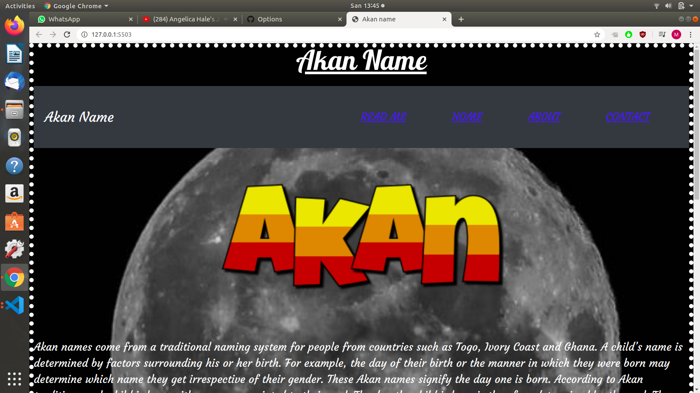
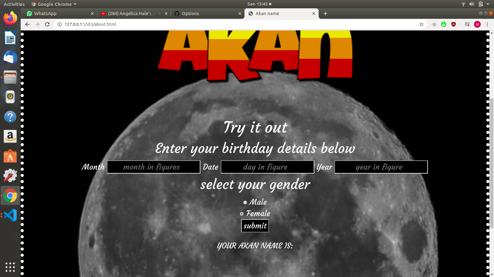
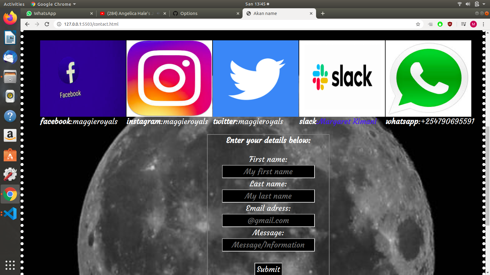

# Akan Name
#### Akan Name, 14/Feb/2020
#### By **Margaret Kimani**
## Description
>>The Akan people of Ghana frequently name their children after the day of the week they were born and the order in which they were born.These "day names" have further meanings concerning the soul and character of the person. This website displays your Akan name according to the day,month and year you were born in.

>Below is a link to the project:
https://wairimu-3.github.io/Akan-Name/
## Technologies Used
>
> 1. HTML
> 2. CSS
> 3. Java Script
> 4. Bootstrap
>
### user stories
> In the home page,you will  be able to read more about akan names and also know their origin and their respective days.The next page is the about page where you can fill in your birthday details and get to know your akan name according to your birth day.The last page is the contact page where you'll find my contact information and how you can reach out to me.

### Links to all projects
>Below are links to other projects:

https://wairimu-3.github.io/portfolio/

>>This is a website that gives information about me, lets you get to know more about me and how you can reach out to me.

https://wairimu-3.github.io/Royals-/

>>Royals is a project that talks about life and all its challanges.It also talks about how to deal with and overcome those challanges.

https://beryl01.github.io/My-Tailor/

>>My tailor is a website that gives tailors a platform to sell out and also showcase their good work.It also enables the user to book a tailor and make an order of ready-made clothes or tailored clothes online.The clothes are delivered to you as soon as they are done.
### Contact 
+  Email: kimanimargaret46@gmail.com
-  phone: 0790695591
+  slack: Margaret Kimani 
### License
MIT licence

https://choosealicense.com/licenses/mit/

&copy 2020;
Margaret Kimani